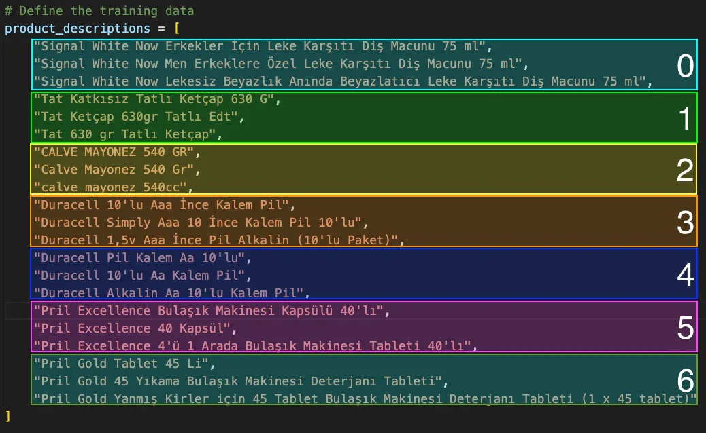

# Product Name Matching with BERT

## Overview

This repository contains code for training a product similarity model using the BERT-based transformer for sequence classification. The model is designed to categorize product descriptions into predefined classes based on their similarity. You can check the article on [Medium](#https://medium.com/@tufekcisencer/dead-simple-product-name-matching-with-nlp-f55c3ce4dcce) for more details.

## Files

### train.py

This script trains the product similarity model using a set of labeled product descriptions. The key components and steps include:

Importing necessary libraries and checking for the availability of multi-process support in PyTorch.
Defining the training data, which consists of product descriptions and corresponding labels.
Installing and using the BERT tokenizer for the Turkish language.
Tokenizing and padding the input sequences to create a tensor suitable for training.
Defining the model architecture, optimizer, and loss function.
Training the model with early stopping based on loss convergence.
Saving the trained model and tokenizer for later use.
check.py
This script demonstrates how to load the trained model and tokenizer and use them to make predictions on new, unseen data. It includes the following steps:

Loading the trained model and tokenizer from the saved paths.
Providing test data in the form of product descriptions.
Tokenizing and formatting the test data for model input.
Evaluating the model on the test data and obtaining predictions.
Displaying the predicted labels for each product description.

## Usage

To train the model, run train.py. To check the model's predictions on new data, execute check.py. Ensure that the required dependencies, including the transformers library, are installed.

### Dependencies

PyTorch
Transformers library (Hugging Face)

## Notes

The model is based on the BERT Turkish uncased model (dbmdz/bert-base-turkish-uncased).
The number of classes in the classification task is set to 7, corresponding to specific product categories.
Feel free to reach out if you have any questions or need further assistance!
